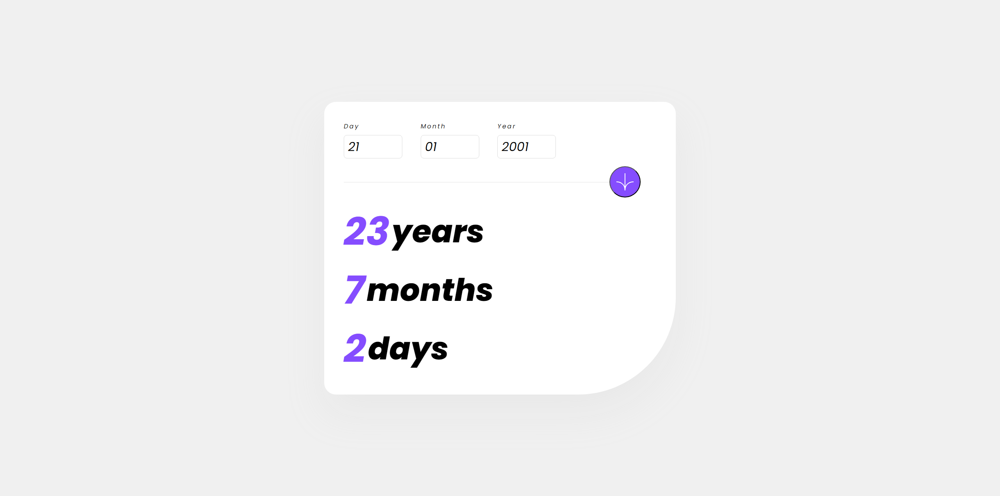

# 🎂 Age Calculator App

This is a simple and intuitive web application that allows users to calculate their exact age based on their birthdate. The app displays the result in a clear and visually appealing format, showing the age in years, months, and days. It is fully responsive, making it accessible across all devices.

## Live Demo

You can try the app live by visiting [Live Demo](your-live-demo-link).

## Features

- Input your birthdate (day, month, year) to calculate your exact age.
- The result is displayed clearly in bold, showing years, months, and days.
- User-friendly and responsive design for seamless use on mobile, tablet, and desktop devices.
- Smooth and minimalist interface, making the user experience enjoyable.

## How It Works

1. Enter your birthdate in the day, month, and year fields.
2. Click the calculate button to view your exact age.
3. The app will display your age in a large, bold format showing years, months, and days.

## Technologies Used

- HTML
- CSS
- JavaScript
- React

## Screenshot

